# Suivi et Accompagnement des individus pendant leurs régimes alimentaires. 

<h2>Interface d’accueil : </h2>
Après avoir développé le système, nous allons présenter quelques interfaces qui correspondent à
notre application.
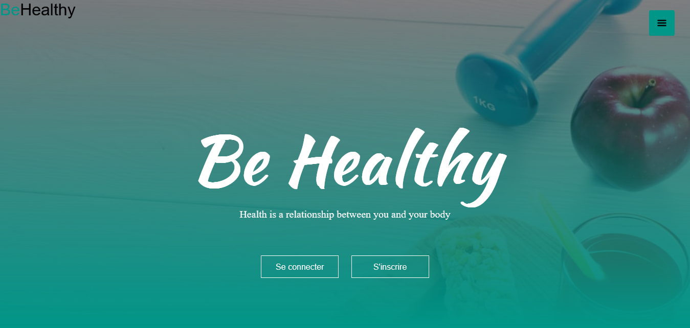

<h2>Interface d’inscription : </h2>
Cette page représente la page d’inscription où le visiteur doit entrer ses informations personnelles
afin de créer un compte.
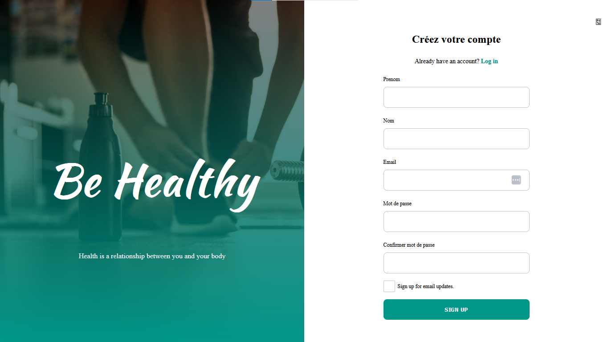

<h2>Interface d’authentification : </h2>
La page ci-dessus est consacré à l’utilisateur et à l’administrateur afin qu’ils se connectent dans
leurs espaces personnels ; et dont l’utilisateur aura accès à toutes les fonctionnalités du site.
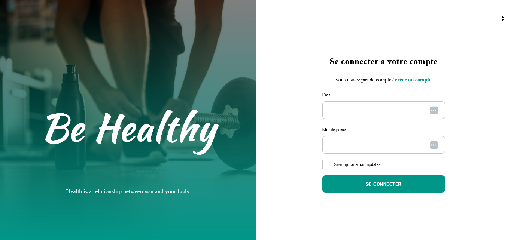

<h2>Interface HOME : </h2>
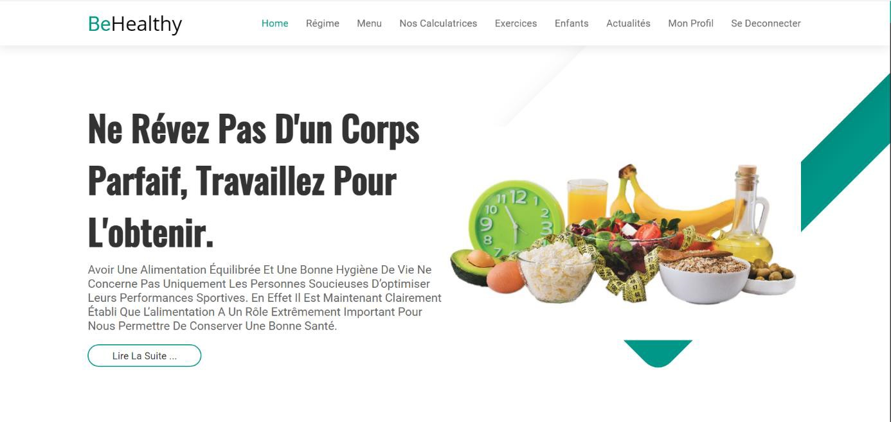

<h2>Calculateur d'energie quotidienne totale (TDEE) :</h2>
Ces figures représentent tous les calculs des calories que contient le site, notamment le calcul du BMR les
macronutriments etc. 
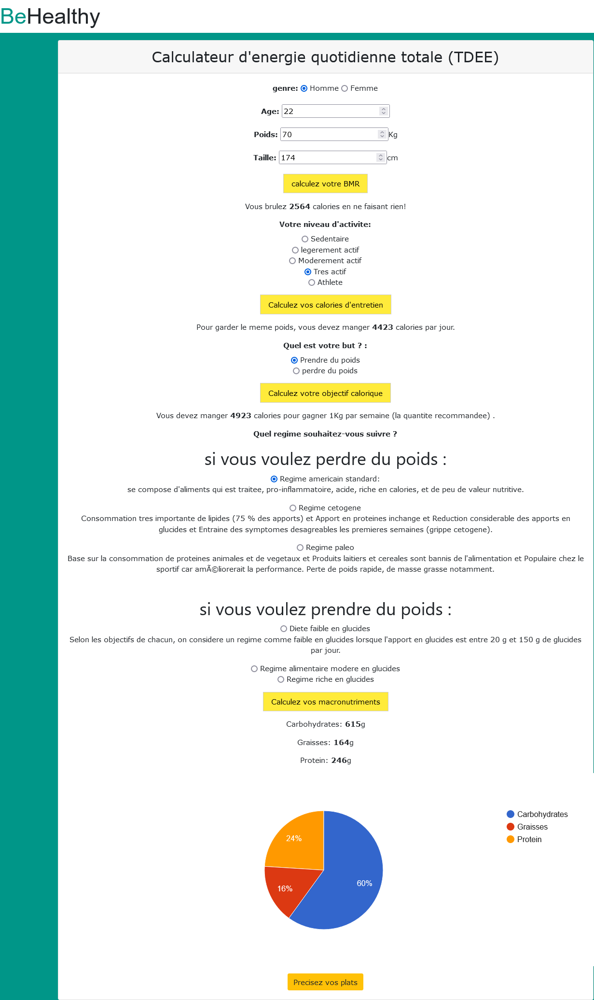

<h2>Calculer votre IMC :</h2>
Calculer votre poids ideal
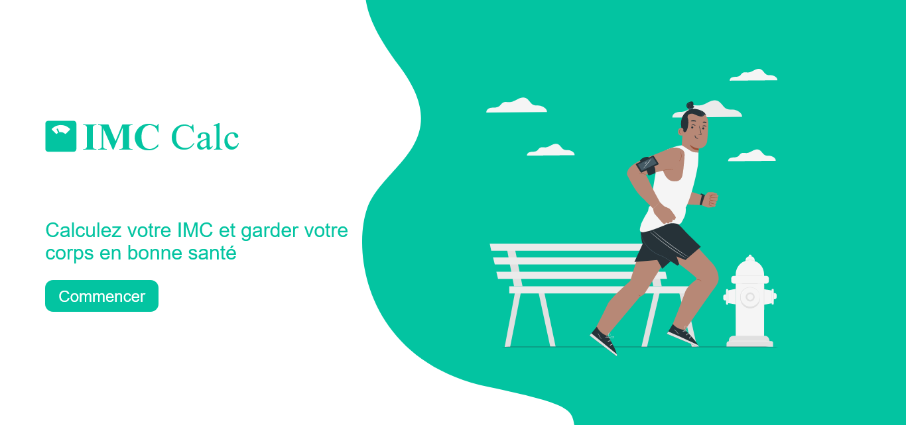
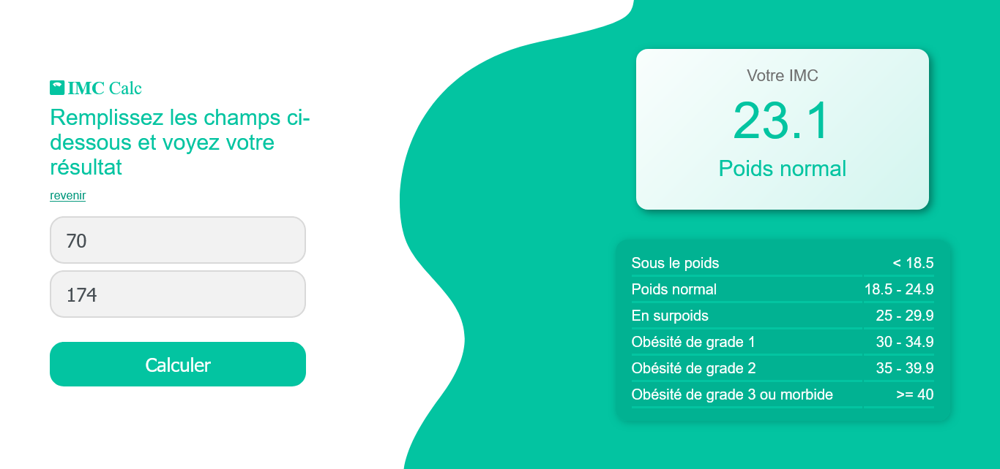

<h2>Interfaces des vidéos d’exercice :</h2>
Cette page comporte les vidéos de sport suggérées aux utilisateurs.
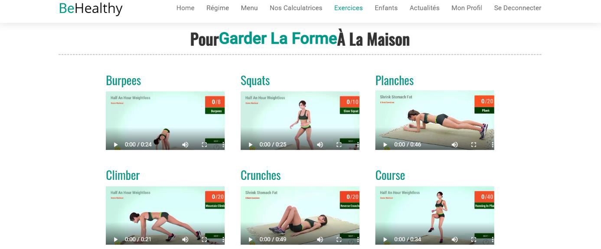

<h2>Interface de l’espace enfant :</h2>
La capture représente l’espace dédié aux enfants dont on trouvera des conseils, des propositions des recettes
et les répartitions caloriques recommandées.
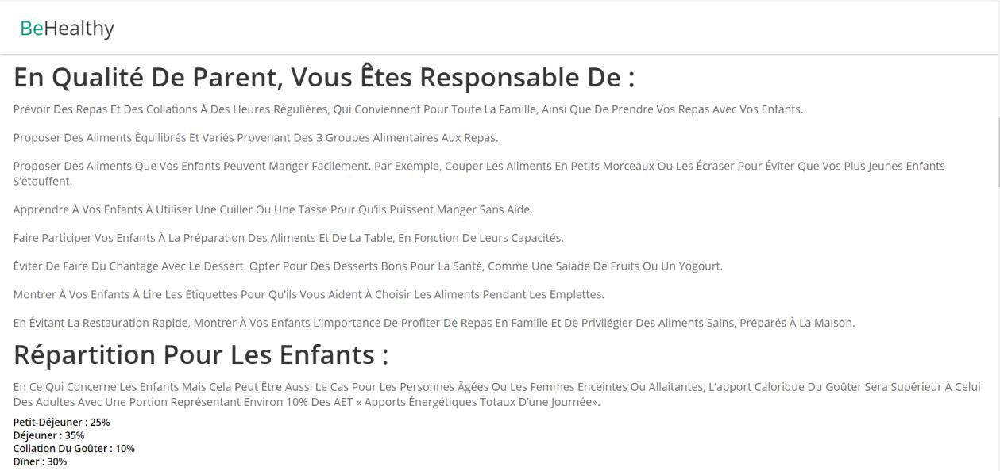

<h2> Interface de l’espace personnel :</h2>
Cette page représente l’espace de l’utilisateur tout en affichant son nom, prénom, email, date de
création du compte ainsi que son historique.

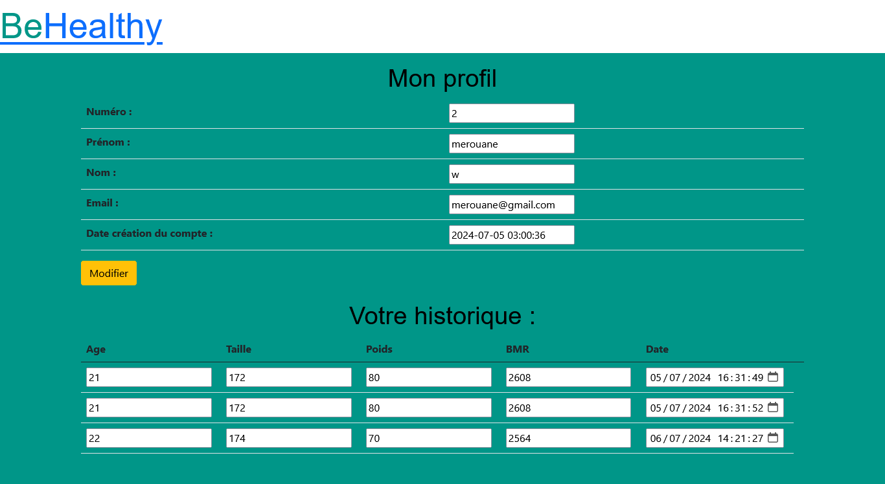

<h2> Interface de l’espace administrateur :</h2>

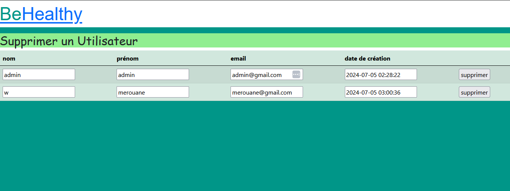

